||||
| :- | :-: | -: |

## **MINI PROJECT-I** 
**(22ITC07)** 
## **REPORT**
**on**

**Student Edge**

**Submitted in partial fulfilment for the completion of**

**BE-IV Semester**

**in**

**INFORMATION TECHNOLOGY**

**By**

` `**Amja Maithili(160123737141)**

**Under the guidance of**

` `**Dr. Prathima Tirumalareddy**

**Assistant Professor,** 

**Dept. of IT**

**DEPARTMENT OF INFORMATION TECHNOLOGY** 

**CHAITANYA BHARATHI INSTITUTE OF TECHNOLOGY** 

***(Autonomous)***

**(Affiliated to Osmania University; Accredited by NBA(AICTE) and NAAC(UGC), ISO Certified 9001:2015)**

**GANDIPET, <http://www.cbitworld.com/><http://www.cbitworld.com/>**

**HYDERABAD – 500075**

**Website: [**www.cbit.ac.in**](http://www.cbit.ac.in)**

` `**2024-2025**

**CERTIFICATE**

This is to certify that the project work entitled “**STUDENT EDGE**” submitted to CHAITANYA BHARATHI INSTITUTE OF TECHNOLOGY, in partial fulfilment of the requirements for the award of the completion of Mini Project-I (22ITC07) IV semester of B.E in Information Technology, during the academic year 2024-2025, is a record of original work done by **Amja Maithili(160123737141)**,during the period of study in Department of IT, CBIT, HYDERABAD, under our supervision and guidance.

**Project Guide**                                                            **Head of the Department**

Dr. Prathima Tirumalareddy                                       Dr.M.Venu Gopalachari

Asst. Professor,                                                           Professor,

Dept.  of  IT,                                                                Dept.  of  IT,

CBIT, Hyderabad.                                                       CBIT, Hyderabad.

**ABSTRACT**

The Student Edge platform is a full-stack web application designed to streamline student career development. It serves two primary user groups: students—who manage their profiles, update achievements, and generate customized resumes—and the Career Development Cell (CDC), which leverages AI-powered features to efficiently search, match, and shortlist candidates.

Key features of Student Edge include comprehensive student profile management, AI-driven resume generation, a CDC dashboard with advanced filtering options, and document parsing for job requirement analysis. The platform utilizes a modern technology stack comprising a React frontend, an Express.js backend, a Flask microservice for Deepseek AI integration, and MongoDB for scalable data storage.

This robust architecture enables the system to offer a responsive and seamless user experience while effectively managing the complexities of data handling and AI processing. By automating and enhancing the career development process, Student Edge aims to bridge the gap between students and employment opportunities. It empowers students to present themselves professionally and equips the CDC with powerful tools to connect with the right candidates.

Student Edge’s design also supports future scalability, with deployment potential on cloud platforms such as AWS. The platform stands as a comprehensive solution tailored to modern career-building challenges, ensuring long-term relevance and functionality. Through its innovative approach, Student Edge redefines how academic institutions support student career growth in a dynamic job market.

**TABLE OF CONTENTS**

|CERTIFICATE|ii||
| - | - | :- |
|ABSTRACT|iii||
|TABLE OF CONTENTS|iv||
|LIST OF TABLES|v||
|TABLE OF FIGURES|v||
|TABLE OF ABBREVIATIONS|viii||
|ACKNOWLEDGEMENTS|ix||
|1\.|INTRODUCTION|1|
||1\.1. Digital Pumpkin	|1|
||1\.2. Project Timelines|2|
||1\.3. Literature Survey|4|
|2\.|SYSTEM REQUIREMENTS|6|
||2\.1. Hardware Requirements|6|
||2\.2. Software Requirements|6|
||2\.3. Backend Requirements|6|
||2\.4. Frontend Requirements|6|
||2\.5. Authentication Requirements|7|
||2\.6. AI integration Requirements|7|
|3\.|TECH STACK|8|
||3\.1. Frontend Technologies|8|
||3\.2. Backend Technologies|9|
|4\.|SYSTEM DESIGN AND METHODOLOGY|11|
||4\.1. System Architecture|11|
||4\.2. Development Methodology|12|
||4\.3. Gen Ai Integration|14|
|5\.|IMPLEMENTATION OF PROJECT|15|
||5\.1. Frontend |15|
||5\.2. Backend|17|
|6\.|PROJECT VISUALS|21|
||6\.1. Home Page|21|
||6\.2. Student Portal|21|
||6\.3. CDC Portal|26|
||6\.4. Databases|34|
||6\.5. GitHub Repository|35|
|7\.|CONCLUSION AND FUTURE SCOPE|36|
|8\.|KEY TAKEAWAYS |38|
||8\.1 Techstack|38|
||8\.2 Digital Pumpkin|38|
||8\.3 Gen AI Feature |38|
||8\.4  Prompt Engineering|38|
||8\.5 Salesforce Certifications|39|
||8\.6 Github Timelines|39|
||8\.7 Linkedin post|40|
||8\.8 Honeywell presentation|40|
||8\.9 My contributions and learnings|41|
| |BIBLIOGRAPHY|42|

**LIST OF TABLES**

|**Table No.** |**Description** |**Page No.** |
| - | - | - |
|Table 1 |Table of Contents |` `iv|
|Table 2 |Table of Figures|` `vi|
|Table 3 |Table of Abbreviations |` `viii|
**\

**LIST OF FIGURES**

|**Figure No.** |**Description** |**Page No.** |
| - | - | - |
|Fig 1.1|Timeline of all the features|` `2|
|Fig:4.1:|System Design of Student Edge|` `12|
|*Fig 5.1:*|Frontend file structure|` `15|
|*Fig 5.2:* |Package. Json file showing project dependencies like React, Axios|` `15|
|*Fig 5.3:*|vite.config.js|` `16|
|*Fig 5.4:*|src/App.jsx ,the main component of frontend file showing all routes and render navbar|` `16|
|*Fig 5.5:*|src/routes/AppRoutes.jsx, for handling the routes of all pages|` `16|
|*Fig 5.6:* |src/pages/Login.jsx, demonstrating usage of axios for making Http reque|` `17|
|*Fig: 5.7:* |Backend File Structure|` `17|
|*Fig 5.8:* |Server.js|` `18|
|*Fig: 5.9:* |Student Controller.js|` `18|
|*Fig: 5.10:*|CDC controller.js|` `19|
|*Fig:5.11:* |Document parsing for Search|` `19|
|*Fig:5.12:* |Resume Generation|20|
|Fig:6.1: |Student Edge Landing Page|21|
|Fig:6.2: |Student Login Interface|` `21|
|*Fig 6.3:* |Personalized Welcome Screen|22|
|*Fig 6.4:* |Student Profile Overview|22|
|` `*Fig 6.5:* |Background details|23|
|*Fig 6.6:* |Update profile|24|
|*Fig 6.7:* |Resume Output Preview|24|
|Fig 6.8:|Password Reset Interface|25|
|*Fig 6.9:* |Password Strength Enforcement|25|
|*Fig 6.10:*|CDC Secure Login Page|26|
|*Fig 6.11:*|Overview of CDC Dashboard|26|
|*Fig 6.12:*|Email Validation|27|
|*Fig 6.13:*|Student View in CDC Dashboard|27|
|*Fig 6.14:*|Full Student Profile (Academic + Personal)|28|
|*Fig 6.15:*|Sorting Students by Branch|29|
|*Fig 6.16:*|Section-wise Sorting|29|
|*Fig 6.17:*|Year-wise Student Categorization|30|
|*Fig 6.18:*|Filtering Based on CGPA Threshold|30|
|*Fig 6.19:*|Roll Number-Based Filtering|31|
|*Fig 6.20:*|` `Name-Based Filtering|31|
|*Fig 6.21:*|Uploading Requirements (PDF, DOC, DOCX)|32|
|*Fig 6.22:*|Smart Search Recognizing Variants|33|
|*Fig 6.23:*|Intelligent Typo Correction in Search|33|
|*Fig 6.24:*|Download Filtered Data as CSV|34|
|Fig:6.25:|Student Database|34|
|Fig:6.26:|CDC Database|35|
|Fig:6.27:|GitHub Repository|35|
|Fig:8.5:|Salesforce certifications|40|
|Fig:8.6:|Honewell Presentation |41|
|Fig:8.7:|Linkedin posts|41|
|Fig:8.8:|Github timeline and commits|42|

**LIST OF ABBREVIATIONS**

|**S. No**|**Abbreviation** |**Full Form** |
| - | - | - |
|1 |**MERN** |MongoDB, Express.js, React.js, Node.js |
|2 |**REST** |Representational State Transfer |
|3 |**API** |Application Programming Interface |
|4 |**JWT** |JSON Web Token |
|5 |**IDE** |Integrated Development Environment |
|6|**VS Code** |Visual Studio Code |
|7|**UI** |User Interface |
|8|**CRUD** |Create, Read, Update, Delete |
|9|**HTML**|Hypertext Markup Language|
|10|**CSS**|Cascading Style Sheets|
**\

**ACKNOWLEDGEMENTS**

` `I would like to express my sincere gratitude to all those who supported me throughout the development of this project.

First and foremost, I extend my heartfelt thanks to **Dr. T. Prathima Ma’am**, our Mini Project guide, for her consistent support, insightful suggestions, and valuable feedback. Her encouragement to think from a CDC member’s perspective played a significant role in shaping the features of the platform—especially in designing smart filters, keyword search, and student shortlisting tools that serve real placement needs.

To my teammate, **K. Sai Rasagna(160123737151)**, for being biggest strength throughout the journey from  fixing the last-minute bugs, sitting through long debugging sessions, or constantly working on new features. Your active collaboration, dedication, and effort were crucial to the overall progress of this project

I’d like to express my gratitude to **Yejju Yamini Sri Vishnu Vamsith (160121737204)** from the IT Department, IT3, who taught us how to integrate Generative AI features into our project using Flask. His guidance was invaluable in helping us implement AI into our platform, turning a complex idea into something practical and functional. The knowledge he shared made a significant difference in how we approached the technical aspects of our AI integration.

For the AI features, I used **DeepSeek** for implementing generative AI functionalities like skill extraction ,profile matching ,resume generation and AI powered search bar. For code generation, debugging, and learning new features, I relied on **ChatGPT**, **Grok**, and **Claude**. These tools played an essential role in speeding up development, from generating code snippets to solving errors and even exploring new ways to improve the project. Their capabilities allowed me to focus more on refining features rather than getting stuck in technical challenges.

A special thanks goes to the **Students** who inspired this idea. Seeing friends and classmates struggle with keeping their profiles updated or making resumes before placements made me realize how important it is to simplify that process. That’s who I kept in mind while building this platform people like us, who just need a simpler, less stressful way to manage our student journey.

The Digital Pumpkin problem-solving framework helped us break down our idea into a clear problem, solution, and execution plan. It provided a structured approach that made the development journey smoother and more goal-oriented. All the question and answers have played an important role on how to implement the features and question myself about the feature in depth.

Integrating AI-powered features like resume analysis, skill extraction, and match percentage calculation was a major highlight. Exploring tools like Gemini and DeepSeek challenged me to think beyond basic development, and pushed me to learn new techniques I hadn't anticipated. Handling the code to get the required output using the genAI was difficult and challenging but it was were thrilling to thrive for getting the expected result.

This project was more than just an academic task it was a real-world learning experience that taught me not just how to code better, but how to think better and also tested me in many ways. From staying up late to understand a new AI tool, to refreshing the layout for the tenth time just to make it more user-friendly.  The process wasn’t always perfect, but it helped me realize that what matters most is creating something meaningful and useful. This journey, although challenging, gave me the confidence to take on bigger challenges ahead.

2

||||
| :- | :-: | -: |

**1. INTRODUCTION**

**1.1 DIGITAL PUMPKIN**

The Student Profiling System, "Student Edge", is designed to streamline student shortlisting and ensure timely updates on academic and career opportunities. It serves as a centralized platform where students and the Career Development Cell (CDC) can efficiently manage and access relevant information. The primary focus is to enable the CDC to shortlist students based on academic performance, skills, and eligibility criteria, thereby making recruitment and mentorship more effective. By incorporating advanced search filters, role-based access, and automated notifications, "Student Edge" simplifies the CDC’s workload, accelerates shortlisting, improves decision-making, and facilitates seamless communication. It helps students update their background details i.e. details related to school or inter college, and also any past achievements and present details such as CGPA, Extra and Co cirricular activities etc. It also includes storing student’s linkedin profile, GitHub profile and other competetative coding profiles. In short, it gives complete profile of the student.

Student Edge has several key features. It employs Role-Based Access Control (RBAC). Students can create and view their profiles, while the CDC has complete access to all profiles and can use keywords and filters for advanced search. The system also includes Profile Management, allowing students to create and update their profiles with personal details, skills, projects, and achievements. A Search Engine  extracts keywords from student profiles (e.g., skills, projects) and fetches profiles based on the relevance of searched keywords. For Authentication & Security, JWT-based authentication ensures secure login/logout processes, and passwords are secured using bcrypt hashing. It also has a generate Resume option, which helps students generate resume in seconds, with any specific requirements they have. It takes the message from user as input and generates resume accordingly.

The Student Profiling System is developed using the MERN stack (MongoDB, Express.js, React.js, Node.js) to ensure efficiency, scalability, and security. The frontend uses React.js with Tailwind CSS to provide a dynamic and interactive user interface with a modern and responsive design. React.js is used to build a dynamic UI with modular components for dashboards, student profiles, and notifications. React Router manages navigation, Tailwind CSS is integrated for design, Axios is used to fetch data, and state management is handled using useState, useEffect, and useContext (or Redux). The backend uses Node.js with Express.js to manage API endpoints and business logic, ensuring a high-performance, non-blocking, event-driven architecture. Express.js creates RESTful API endpoints, middleware functions handle requests, Express Validator ensures input validation, and Multer handles file uploads. MongoDB is used as a NoSQL database, with MongoDB Atlas for storage, Mongoose for ORM, and MongoDB Text Indexing for efficient searching. JSON Web Token (JWT) ensures secure authentication and role-based access control. Bcrypt.js is used to hash passwords, CORS is configured, Helmet.js is used, and Rate Limiting is applied.

**1.2 PROJECT TIMELINES**

**Fig 1.1** *Timeline of all the features*

**Week 1 (Jan 22 - Jan 28, 2025)**

` `Problem Identification/Selection. Reviewing features and Technology stack used for project. Analyzed placement cell requirements and identified key challenges in the student shortlisting process.

**Week 2 (Jan 29 - Feb 4, 2025)**
**\
` `Starting Preparation of Digital pumpkin. Getting started with frontend and backend parallelly. Installing necessary packages and applications. Created initial wireframes and flow diagrams for system architecture.

**Week 3 (Feb 5 - Feb 11, 2025)** 

Continuing development of Digital pumpkin. Setting up basic project structure. Learning about LLM integration possibilities. Researched various LLM options and their suitability for resume parsing and matching features.

**Week 4 (Feb 12 - Feb 18, 2025)** 

Submission of Abstract and Digital Pumpkin. Further research on LLM integration. Initial planning for authentication system. Finalized feature list and technical specifications after stakeholder discussions**.**

**Week 5 (Feb 19 - Feb 25, 2025)** 

Initial Setup and Environment Configuration. Set up Node.js backend and React.js frontend with Vite. Configure MongoDB with Mongoose connections. Standardize folder structures for scalable development. Established CI/CD pipeline for smoother integration of code changes**.**

**Week 6 (Feb 26 - Mar 4, 2025)** 

Student Profile Module development. Creating responsive forms for student data entry. Implementing fields for professional information. Starting work on database schemas for student profiles. Added validation logic and error handling for all form inputs**.**

**Week 7 (Mar 5 - Mar 11, 2025)**
**\
` `Completion of Student Profile Module. Authentication & Access Control implementation. JWT-based authentication with secure login mechanisms. Implementation of role-based access (RBAC) for Students and CDC roles. Created password reset functionality and email verification system.Implementing fields for personal information also.

**Week 8 (Mar 12 - Mar 18, 2025)**

` `Resume Generation Module development. Implementing automatic resume generation from profile data. Ensuring secure data access through encrypted tokens and route guarding. Created multiple resume templates with customization options. Implementing change password option.

**Week 9 (Mar 19 - Mar 25, 2025)**

CDC Dashboard Development. Building interactive dashboard for student profile viewing. Creating table layout with roll numbers, names, and quick access buttons. Implementing basic filters (CGPA, branch, section). Worked on the profile picture update in profiles of students.

**Week 10 (Mar 26 - Apr 1, 2025)**

AI Search Engine Integration. Integrating generative AI model (DeepSeek). Enabling natural language and keyword-based search.  Optimized query processing for faster search results and implemented caching for frequent queries. Successfully implemented the profile picture update functionality.

**Week 11 (Apr 2 - Apr 8, 2025)** 

Resume Parsing & AI Matching. Adding job description/resume upload functionality. Implementing skill extraction using NLP. Developing percentage-based profile matching system. Created an adaptive algorithm that improves match quality based on CDC feedback and historical selections.

**Week 12 (Apr 9 - Apr 15, 2025)**

Match Filtering & Shortlisting Features. Introducing real-time filtering based on match percentage. Combining AI matching with traditional filters. Implementing efficient student shortlisting with single-click actions.CSV Export functionality. Final UI/UX improvements. Form validation and error handling.

**Week 13-14 (Apr 16 - Apr 20, 2025)**

Documentation of the entire project. Creating user manuals and technical documentation. Preparing final presentation materials.

**1.3 LITERATURE SURVEY** 

The development of **Student Edge** is inspired by several existing works in the domains of student profile management, placement systems, and the integration of artificial intelligence in education and recruitment. A review of the current literature highlights both the limitations of traditional systems and the growing relevance of AI-driven approaches. 

**Existing Systems:** 

**T&P Portals in Universities**: Most training and placement portals allow only basic data entry and manual shortlisting. These systems lack intelligent search, resume generation, or automated match-making. 

**Job Portals (e.g., Naukri, LinkedIn):** Though powerful and widely used in the industry, these platforms are not designed with students or academic institutions in mind. They lack the ability to effectively filter student-specific attributes such as CGPA, branch, section, or co-curricular involvement. For CDC, this makes it highly challenging to extract relevant candidate lists for campus recruitment drives. The filtering tools are too generic, often based on experience levels or broad skill tags.

**Relevant Research:** 

**A Framework for an Automated Student Profiling System** – highlights the importance of structured student data collection and its role in easing placement activities. 

**AI-Based Resume Parsing for Smart Recruitment** – explores how machine learning models can extract and match candidate data to job requirements. 

**Enhancing Placement Management Systems with AI Integration** – suggests integrating NLP and recommendation systems for improved candidate selection. 

**Gaps Identified:** 

1\.Lack of AI-driven candidate-job matching in student-centric platforms 

No dynamic resume generation linked to internal profile data 

2\.Absence of document-based intelligent search for training & placement officers. 

**Role of AI Tools in Student Edge:** 

To address these gaps, **Student Edge** integrates AI components powered by tools such as: 

**Deepseek API (or equivalent NLP model)** for intelligent keyword extraction and profile matching. **Resume Parsing Engine** to convert uploaded resumes into structured profile fields**. Similarity Matching Algorithms** to calculate match percentages between students and job requirements. **Search Intelligence Module** enabling CDCs to perform advanced queries and get results.

**2. SYSTEM REQUIREMENTS**
### **2.1 HARDWARE REQUIREMENTS**
To ensure Student Edge operates efficiently during development, testing, and in its final usage, certain hardware specifications are recommended. The minimum processor requirement is an Intel C ore i5 (8th Gen) or AMD Ryzen 5, but for enhanced performance, an Intel Core i7 (10th Gen+) or AMD Ryzen 7 is preferred. Memory should be at least 8 GB RAM; however, 16 GB or more is recommended. For storage, a minimum of 100 GB of free disk space is necessary, and an SSD is preferred to improve speed. The display should be at least 13" with a 1366x768 resolution, though a 15"+ display with 1920x1080 resolution is recommended. A stable, high-speed internet connection, ideally fiber, is essential.
### **2.2 SOFTWARE REQUIREMENTS**
Student Edge's software requirements include compatibility with operating systems such as Windows 10/11, macOS Monterey/Ventura, and Ubuntu 20.04/22.04. The primary IDE is Visual Studio Code, along with extensions like Prettier, ESLint, and GitLens. Git 2.30+ and a GitHub account are required for version control. API testing is facilitated by Postman v9+, and deployment is handled by Netlify for the frontend and Render/Railway for the backend. The application is designed to be compatible with modern browsers, including Chrome 90+, Firefox 88+, Safari 14+, and Edge 90+.
### **2.3 BACKEND REQUIREMENTS**
The Student Edge backend is built using Node.js v18.x+ as the runtime environment, Express.js v4.18.x as the web framework, and Mongoose v7.x as the ORM. Essential middleware includes CORS v2.8.x, Dotenv v16.x, and Nodemon v2.0.x. Authentication is implemented with bcryptjs v2.4.x and jsonwebtoken v9.0.x, and request parsing is managed by body-parser v1.20.x. The database used is MongoDB Atlas.

**2.4 FRONTEND REQUIREMENTS**

Frontend development for Student Edge relies on React.js v18.x, React DOM v18.x, and React Scripts v5.x. HTTP communication is managed with Axios v1.3.x, while data visualization utilizes Chart.js v4.2.x and React-Chartjs-2 v5.2.x. Styling is achieved with Styled-Components v5.3.x, and user interface components include React-Datepicker v4.10.x and Moment.js v2.29.x. Navigation is handled using React Router DOM v6.8.x, and Create React App is used for project setup.
### **2.5 AUTHENTICATION REQUIREMENTS**
Student Edge employs JWT for authentication, with password security provided by bcryptjs. Session management is token-based, including configurable expiration. Protected route middleware enforces authorization. Token persistence is currently local storage, with plans to transition to more secure cookie-based storage in the future

**2.6 AI INTEGRATION REQUIREMENTS**

For future AI integration, Student Edge will utilize the Deepseek API. This will involve Node.js client libraries for communication, additional storage for caching, environment variables for API key management, and rate limiting middleware. The design is modular, ensuring the core application can function independently of the AI components.

### **3. TECH STACK**
This section elaborates on the technologies, tools, frameworks, APIs, and libraries employed in the development of the Student Profile Management System. The system leverages a combination of frontend and backend technologies to provide a seamless and efficient user experience for managing and updating student information. 

**3.1 FRONTEND TECHNOLOGIES**

The frontend of the Student Profile Management System is built using modern web development technologies to create an interactive and user-friendly interface. 

**3.1.1 REACT**

**Description:** React is a declarative, efficient, and flexible JavaScript library for building**1** dynamic and interactive user interfaces. It follows a component-based architecture, allowing for the creation of reusable UI elements. React's virtual DOM enhances performance by efficiently updating only the necessary parts of the UI. We utilized React to structure the various pages and components of the student profile management system, including the profile view pages, and the update forms. React's ecosystem provides a rich set of tools and libraries that facilitate various aspects of frontend development. 

**3.1.2 REACT ROUTER DOM** 

**Description:** React Router DOM provides the necessary components and hooks to implement client-side routing within the single-page application. This allows users to navigate between different views (e.g., profile pages, update forms) without requiring a full page reload, resulting in a smoother and more responsive user experience. We used useNavigate, Link, and Route components from React Router DOM to manage navigation between the different sections of the student profile management system. 

**3.1.3 AXIOS**

**Description:** Axios is a popular library for making asynchronous HTTP requests to communicate with the backend API. It provides features like request and response interception, automatic transformation of JSON data, and more. We employed Axios within our React components to fetch student data from the backend API endpoints and to send updated data when users submit the update forms (using GET and PUT requests). 

**3.1.4 CSS** 

**Description:** CSS is used to control the presentation and layout of the HTML elements in the frontend. We utilized custom CSS files to style the components, ensuring a visually appealing and consistent user interface. This includes managing layout, colors, fonts, and responsiveness of the application across different screen sizes.**  

**3.2 BACKEND TECHNOLOGIES**

The backend of the Student Profile Management System is responsible for handling data storage, API endpoints, and business logic. In this architecture, we utilize a combination of Node.js with Express.js for the primary API and a separate Python Flask application for specific integration tasks. 

**3.2.1 Node.js** 

**Description:** Node.js is a cross-platform, open-source JavaScript runtime environment that executes JavaScript code outside of a web browser. Its event-driven, non-blocking I/O model makes it efficient for building scalable network applications, including web servers and APIs. We used Node.js as the primary runtime environment for our core backend API, handling student data management, authentication, and serving the main application logic.  

**3.2.2 Express.js** 

**Description:** Express.js provides a robust set of features for building web applications and APIs on top of Node.js. It simplifies routing, middleware management, and handling HTTP requests and responses. We utilized Express.js to define our primary API endpoints, implement middleware for authentication (verifyToken), and manage the logic for fetching and updating student data within our controllers (studentController.js). 

**3.2.3 Python Flask** 

**Description:** Flask is a lightweight and flexible micro web framework for Python. It provides essential tools for building web applications and APIs with a focus on simplicity and extensibility. We employed Flask as a separate backend component specifically for handling integration tasks that might be better suited for Python's ecosystem or libraries. This could involve interacting with external services, performing specific data transformations, or leveraging Python's extensive range of specialized libraries. Communication between the primary Node.js/Express.js backend and the Flask application would likely occur via API calls. 

**3.2.4 MongoDB** 

**Description:** MongoDB is a flexible and scalable NoSQL database that stores data in JSON-like documents. Its schema-less nature allows for easy evolution of the data structure. We used MongoDB as the primary database to persist the student profile data, including personal and professional details. Mongoose (mentioned below) was used to interact with the MongoDB database from our Node.js backend.  

**3.2.5 Mongoose** 

**Description:** Mongoose provides a higher-level abstraction for working with MongoDB within the Node.js environment. It allows us to define schemas for our data, perform data validation, and interact with the database using a more object-oriented approach. We used Mongoose to define the schema for our student model, ensuring data integrity and simplifying database interactions within our Node.js controllers. 

**3.2.6 JSON Web Tokens (JWT)** 

**Description:** JWT is a compact and self-contained way for securely transmitting information between parties as a JSON object. In our system, JWTs are likely used for authentication, managed primarily by the Node.js/Express.js backend.

**3.2.7 bcrypt (Node.js Library)** 

**Description:** bcrypt is a widely used library for securely hashing passwords before storing them in the database, likely handled by the Node.js/Express.js backend. 

**3.2.9 multer (Node.js Middleware)** 

**Description:** multer is used within the Node.js backend to handle file uploads, such as the profile picture. 

**3.2.10 CORS(Node.js Middleware)** 

**Description:** CORS is used within the Node.js/Express.js backend to allow the frontend to make requests to the API. 

**4. SYSTEM DESIGN AND METHODOLOGY**

**4.1 SYSTEM ARCHITECTURE**

The **Student Edge** platform employs a modular, full-stack architecture to facilitate student profiling, resume generation, and career development services. The system is divided into five core components: 

**Frontend**: Built with **React**, the frontend provides a responsive user interface for students and the Career Development Center (CDC). Key components include Dashboard.jsx for CDC analytics and student matching, StudentProfile.jsx for profile management, and ProfilePage.jsx for enhanced profile views. Recent additions, such as ChangePassword.jsx, support authentication features. Styling is managed via CSS files (Dashboard.css, StudentCard.css), ensuring a professional and accessible design tailored to user needs. 

**Backend**: The primary backend is developed using **Node.js**, handling general API requests, business logic, and database interactions. Key files include server.js for the main server, studentController.js for student-related endpoints, and cdcController.js for CDC functionalities. File uploads are managed via Multer (upload.js). A separate **Flask** microservice, implemented in Python, is dedicated to AI integration, exposing RESTful endpoints such as /generate-resume for resume creation, /search for AI-powered profile queries, and /upload-requirements for job description analysis. The Node.js backend proxies AI requests to the Flask microservice, ensuring seamless integration with MongoDB and DeepSeek AI via OpenRouter. 

**Database**: **MongoDB** (studentEdgeDB.students) serves as the data storage layer, storing student profiles with fields such as roll\_no, CGPA, skills, linkedin, github, etc along with personal details. The NoSQL structure supports flexible schema updates, accommodating additional fields like portfolio links or resume\_file, enhancing profile versatility. 

**AI Integration**: The **DeepSeek** model (deepseek/deepseek-chat), accessed through the OpenRouter API, powers generative AI features within the Flask microservice. It generates professional resumes, enhances search queries with typo correction and abbreviation expansion, and extracts technical skills from job descriptions. The /ai-status endpoint monitors DeepSeek connectivity, ensuring reliable AI performance. Recent updates, such as the EDUCATION formatting fix in /generate-resume, reflect ongoing refinements. 

**File Upload Service**: The **Multer** middleware, integrated with Node.js via upload.js, handles file uploads (e.g., job descriptions in PDF/DOCX format), facilitating document parsing by the Flask AI microservice. 

The architecture as shown in Fig 4.1 follows a client-server model, with the React frontend communicating with the Node.js backend via HTTP requests. The Node.js backend manages core operations and proxies AI-specific requests to the Flask microservice, which interfaces with MongoDB for data storage and DeepSeek AI for intelligent processing. CORS is enabled in the Flask microservice to support cross-origin requests from the frontend. The system is currently deployed locally, with the Node.js server on port 3000 and the Flask microservice on port 5000, with potential for cloud hosting (e.g., AWS) to enhance scalability. 

**Fig:4.1**: *System Design of Student Edge*

**4.2 DEVELOPMENT METHODOLOGY**

The development of the **Student-Edge** platform is based on the **Agile methodology**, emphasizing iterative development, rapid prototyping, and continuous improvement through stakeholder feedback. This approach enabled the team to adapt to evolving requirements, particularly with the integration of a hybrid backend (Node.js and Flask) and advanced AI features, while ensuring a robust and scalable system. `

Approach Highlights: 

**Requirement Breakdown**: The project was divided into modular feature sets, including student profile management, AI-powered resume generation, CDC dashboard functionalities, and job matching. 

**GitHub-based Collaboration**: Version control was managed using GitHub, facilitating code versioning, issue tracking, and pull request reviews. Individual file commits (e.g., Dashboard.jsx, cdcController.js) reflect iterative improvements and team coordination. 

**Component Testing**: Rigorous testing was conducted at multiple levels. Unit tests validated individual modules, such as the Node.js studentController.js for profile updates and the Flask /search endpoint for AI-enhanced queries. Integration testing ensured seamless interaction between the React frontend (Dashboard.jsx), Node.js backend, and Flask microservice, with tools like Postman and PowerShell (Invoke-RestMethod) used to verify API responses. 

**CI/CD Pipeline**: Automated deployments and testing were implemented using GitHub Actions, streamlining the build, test, and deploy processes. This pipeline supported rapid iteration, with automated tests triggered on each commit to the backend and frontend directories, ensuring consistency across the Node.js server (port 3000) and Flask microservice (port 5000). 

**Development Milestones:** 

**Basic Student Profile Management and Resume Generation**: Initial sprints established the React StudentProfile.jsx for profile entry (fields like roll\_no, CGPA, skills) and the Flask /generate-resume endpoint, leveraging DeepSeek AI to create resumes with iterative fixes (e.g., EDUCATION newline, April 19, 2025). 

**CDC Dashboard with Filters and Keyword-based Search**: Subsequent sprints developed the Dashboard.jsx component, integrating with the Node.js cdcController.js and Flask /search endpoint, enhanced by DeepSeek for keyword accuracy (improved April 15, 2025). 

**AI-powered Resume Parsing and Job Matching**: The Flask /upload-requirements endpoint and Node.js multer/upload.js were implemented to parse job descriptions, with DeepSeek extracting skills, enabling the AI Match Engine to match students by percentage (e.g., based on CGPA, branch). 

**CSV Export for Matched Students**: The final milestone added CSV export functionality to Dashboard.jsx, allowing CDC users to download shortlisted student data from MongoDB via Node.js APIs, completing the career development workflow. 

This Agile approach, supported by GitHub collaboration and CI/CD automation, ensured the Student-Edge platform evolved iteratively, addressing challenges like search relevance and resume formatting while integrating a hybrid Node.js-Flask backend with React frontend and MongoDB storage. 

**4.3 GENERATIVE AI INTEGRATION**

Generative AI, powered by **DeepSeek (deepseek/deepseek-chat)** via the OpenRouter API, is integral to **Student-Edge**, enhancing functionality for students and CDC. The following AI-driven features were developed iteratively: 

**Resume Generation**: The /generate-resume endpoint uses DeepSeek to create professional resumes from student data (e.g., CGPA, skills, certifications). The AI formats sections like TECHNICAL SKILLS and SUMMARY in uppercase, excluding education (added separately). Recent updates (April 19, 2025) fixed EDUCATION formatting to include a newline, ensuring proper display in StudentProfile.jsx. 

**AI-Powered Search**: The /search endpoint enhances query processing by correcting typos, expanding abbreviations (e.g., "AI" to "Artificial Intelligence"), and ensuring technical relevance. Improvements (April 15, 2025) eliminated false positives (e.g., "Chaitanya" for "AI"), delivering precise profile matches. 

**Document Parsing for Keywords**: The /upload-requirements endpoint processes job descriptions (PDF/DOCX) using DeepSeek to extract technical skills (e.g., ["Python", "SQL"]) and summarize requirements. Text extraction leverages PyPDF2 and python-docx, with AI ensuring comprehensive skill identification. 

**AI Status Monitoring**: The /ai-status endpoint validates DeepSeek connectivity, ensuring reliability for all AI features. Enhancements (April 18, 2025) added robust error handling and response validation. 

These features were integrated using a structured prompt-based approach, with DeepSeek processing inputs to generate JSON or text outputs. The AI’s low-temperature settings (e.g., 0.3 for /generate-resume) ensure consistent, structured results. Frontend components (Dashboard.jsx, StudentCard.jsx) render AI outputs, styled via CSS (Dashboard.css) for a professional look. 

**5. IMPLEMENTATION OF THE PROJECT**

**5.1: FRONTEND**

**->**Frontend file structure

***Fig 5.1:** Frontend file structure*

Fig 5.1 shows the folder hierarchy of the frontend React application, including key directories like components, pages, routes, and utilities.

->Built using create react app

***Fig 5.2:** package.json file showing project dependencies like React, Axios, etc*

Fig 5.2 displays the package.json file that lists all installed project dependencies such as React, Axios, and other tools required for frontend development.

->Vite for faster and efficient development

***Fig 5.3:** vite.config.js*

Fig 5.3 shows the Vite configuration file used to define build and server settings for efficient frontend development.

->Main component that wraps all routes, rendering the Navbar conditionally based on role.  

***Fig 5.4:** src/App.jsx ,the main component of frontend file showing all routes and render navbar*** 

\
Fig 5.4 illustrates the main App.jsx file where all the frontend routes are defined, and the navigation bar component is rendered.

->Handling route-level logic

***Fig 5.5:** src/routes/AppRoutes.jsx ,for handling the routes of all pages*

The AppRoutes.jsx file responsible for mapping frontend routes to their respective pages as shown in figure 5.5

->Using axios to simplify making HTTP requests from the frontend to the backend

***Fig 5.6:** src/pages/Login.jsx , demonstrating usage of axios for making Http requests*

Fig 5.6 demonstrates how the Login.jsx component uses Axios to send HTTP requests for user login functionality.

**5.2: BACKEND**

-> Backend File Structure

***Fig: 5.7**: Backend File Structure*

The folder structure depicted in Fig 5.7 outlines how the backend logic is organized into routes, controllers, models, and config files for a modular and maintainable Node.js server*.*

->Server.js - the main file from where the backend runs

***Fig 5.8**: Server.js*

As shown in Fig 5.8, this file initializes the Express server, sets up middleware, and listens on the specified port to serve API requests

*->*Student Controller .js - the controller file for Student Model

***Fig: 5.9**: Student Controller.js*

Fig 5.9 showcases the controller responsible for handling all operations related to student data, such as creating, retrieving, and updating profiles.

-> CDC Controller,js – the controller file for CDC model

***Fig: 5.10**: CDC controller.js*

This Fig 5.10 highlights the controller used by the Career Development Cell (CDC) for managing administrative tasks like accessing and reviewing student profiles.

->Prompt analysis and Resume generation using deepseek

***Fig:5.11**: Document parsing for Search*

The logic shown in Fig 5.11 processes uploaded documents for extracting keywords and indexing them to enhance search engine functionality.

-> Resume genarating Function

***Fig:5.12**: Resume Generation*

As seen in Fig 5.12, the backend generates resumes dynamically based on stored profile data, formatting it into a professional PDF structure.

**6. PROJECT VISUALS**

**6.1 HOME PAGE**

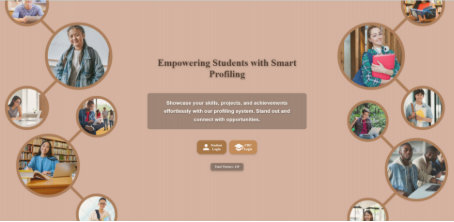

**Fig:6.1**: Student Edge Landing Page

As shown in Fig 6.1, The Student Edge landing page welcomes users with easy access for different user roles through dedicated login buttons for Students and CDC, while the prominently displayed visitor counter highlights the platform's growing reach and community engagement.

**6.2 STUDENT PORTAL**

**->Login**  

`                                                        `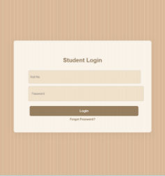                

`                                                            `**Fig:6.2**: *Student Login Interface*

The student login interface, as seen in Fig 6.2, prompts users to enter their roll number and password. 

**->Welcome page**

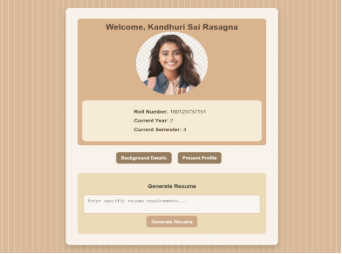

***Fig 6.3**: Personalized Welcome Screen*

\
After successful login, students are greeted with a welcome page as illustrated in Fig 6.3. This page displays basic user information, including name and roll number, and provides quick access to the user’s profile or resume generation.

**->Present Profile**

***Fig 6.4:** Student Profile Overview*

As shown in Fig 6.4, the profile page gives an overview of a student’s data including their profile picture, department, CGPA, semester, social links (LinkedIn/GitHub), and more. 

**->Background details**             

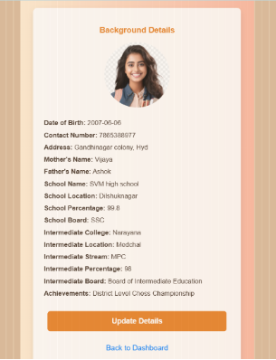

***Fig 6.5:** background details* 

As shown in Fig 6.5, the background details page includes contact information, address, parents’ information, school background, inter college details, past achievements etc.

**->Update profile**

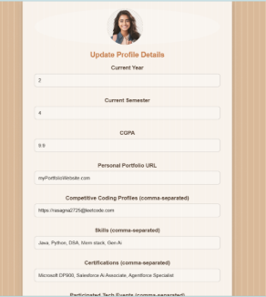

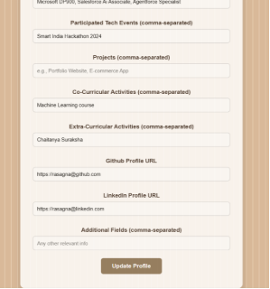

`                                                               `***Fig 6.6: Update profile*** 

As shown in Fig 6.6, the update profile page gives option to update  a student’s data including their profile picture, department, CGPA, semester, social links (LinkedIn/GitHub), and more.

**->Resume Generation**

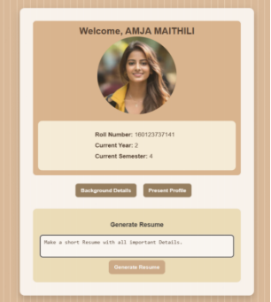  ***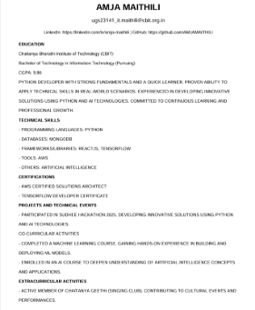***

***6.7:** Resume Output Preview*

\
The resume generation feature, shown in Fig 6.7, allows the student to create a professional resume from the data entered in their profile. The resume is formatted into a PDF and downloaded automatically. This reduces manual effort and ensures consistency.

**->Change Password** 

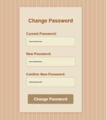

**Fig 6.8:** *Password Reset Interface*

\
As shown in Fig 6.8, students can securely update their login password. The system ensures that the "New Password" and "Confirm Password" fields match before allowing the change.

**->Password Validation** 

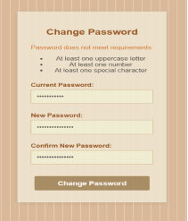

***Fig 6.9:** Password Strength Enforcement*

\
The system enforces a basic level of password complexity, such as a minimum of 8 characters, to enhance account security. Fig 6.9 shows the error message displayed when the password fails to meet these criteria.

**6.3 CDC PORTAL**

**->Login** 

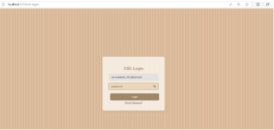

***Fig 6.10:** CDC Secure Login Page*

Fig 6.10 displays the login page for CDC members, who access the platform using their official registered email and password. Once authenticated, they are redirected to a dedicated dashboard

**->CDC Dashboard view** 

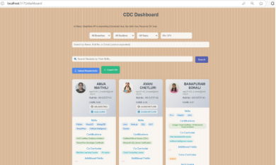

***Fig 6.11:** Overview of CDC Dashboard*

As shown in Fig 6.11, the CDC dashboard offers an overview of student profiles in a structured table. It provides options to sort, search, and filter data, making it easier to manage student placement processes.

**->Email validation**

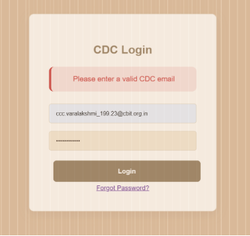

***Fig:6.12***: Email Validation

Validating an email address to ensure it follows the correct format. Specifically, the system checks if the entered email matches the institutional pattern ending with @cbit.org.in, as required by the database for user authentication else throws an error display as shown in Fig 6.12.

**->Student view in CDC Dashboard** 

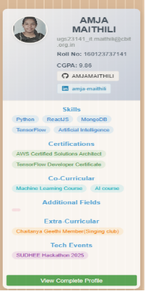

***Fig 6.13:** Student View in CDC Dashboard*

Fig 6.13 shows the main student listing that CDC members interact with. Each entry includes name, roll number, and branch details, along with a "View Profile" button for accessing complete student information.

**->View Complete Profile (Both Professional and Personal details)** 

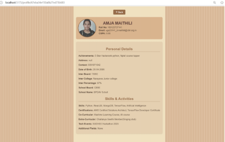

***Fig 6.14:** Full Student Profile (Academic + Personal)*

As shown in Fig 6.14, CDC can view a student’s detailed profile, including academic achievements, co-curricular and extracurricular activities, certifications, and additional notes and their personal details.

**->Sort Students by branch**

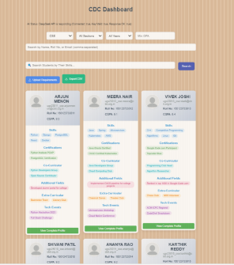

***Fig 6.15:** Sorting Students by Branch*

The sorting mechanism identifies the branch from the roll number (e.g., in 160123737141, “737” indicates the IT 2) and enables CDC to sort the list to view students of a specific department by selecting the branch dropdown as shown in fig 6.15

**->Sort Students by section** 

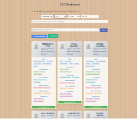

***Fig 6.16**: Section-wise Sorting*

\
As shown in Fig 6.16, students are categorized based on their section, which is typically encoded in the last three digits of their roll number. 

**->Sort Students by year** 

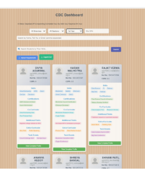

***Fig 6.17:** Year-wise Student Categorization*

\
Fig 6.17 illustrates year-wise grouping based on admission year embedded in the roll number (e.g., "21" -> 4th year). This is especially useful when companies target specific academic years.

**->Sort Students by entering min CGPA** 

As shown in Fig 6.18, CDC can input a CGPA threshold to shortlist candidates. This automated filtering helps identify top-performing students more efficiently.

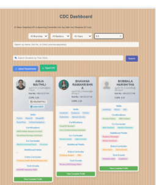

***Fig 6.18**: Filtering Based on CGPA Threshold*

**->Filter students by giving roll numbers or set of roll numbers** 

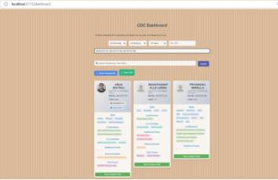

***Fig 6.19**: Roll Number-Based Filtering*

\
As shown in Fig 6.19 the ability to input one or multiple roll numbers for direct access to specific student profiles. This is helpful during follow-ups or for handpicking candidates.

**->Filter students by giving names or set of names**  

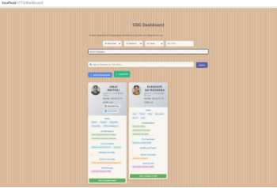

***6.20:*** Name-Based Filtering

\
As shown in Fig 6.20, CDC can search for students by entering their full or partial names. The system displays all matching results dynamically for easy selection.

**->Filter students by skills** 

**Upload Requirements (PDF/DOC/DOCX)**

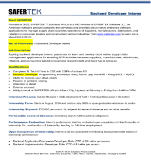

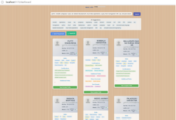

***Fig 6.21**: Uploading Requirements (PDF, DOC, DOCX)*

\
Fig 6.21 shows the upload feature where CDC can submit job requirements in PDF or Word format. The system reads the document, extracts relevant keywords, and uses them to match suitable students based on profile contents.

**->AI Search (Abbreviations + Full Forms)**

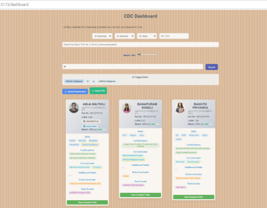

***Fig 6.22:*** *Smart Search Recognizing Variants*

As seen in Fig 6.22, the AI-powered search feature intelligently maps abbreviations to their full forms (e.g., "AI" ->"Artificial Intelligence"). This increases the chances of finding matching students even if different terminology is used.

**->Typo-Tolerant Search**

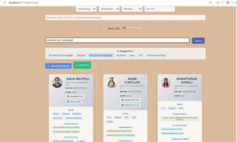

***Fig 6.23**: Intelligent Typo Correction in Search*

\
Fig 6.23 illustrates how the system automatically handles minor spelling errors in the search query. This ensures results are returned even when users mistype keywords.

**->CSV Export**

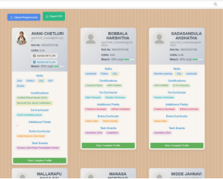   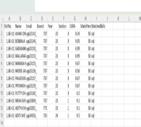

***Fig 6.24**: Download Filtered Data as CSV*

\
As shown in Fig 6.24, the CDC can export filtered student lists as CSV files. This is especially useful for maintaining offline records or sharing candidate details with external recruiters***.***

**6.4 DATABASES**

**->**Student Database** 

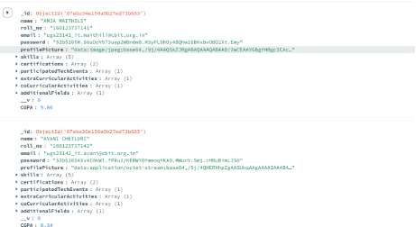

**Fig:6.25:** *Student Database*

As shown in Fig 6.25 student database stores records with different fields such as name, roll number etc.

->Cdc Database** 

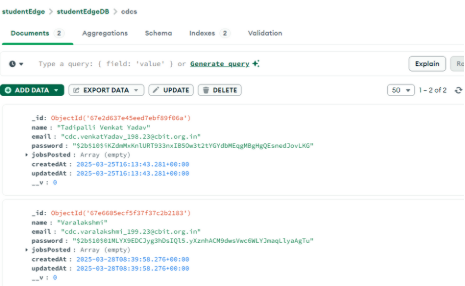

**Fig:6.26**: *CDC Database*

As shown in Fig 6.26, the CDC database stores name, email, password etc.

**6.5: GITHUB REPOSITRY**

**->Github Repository**

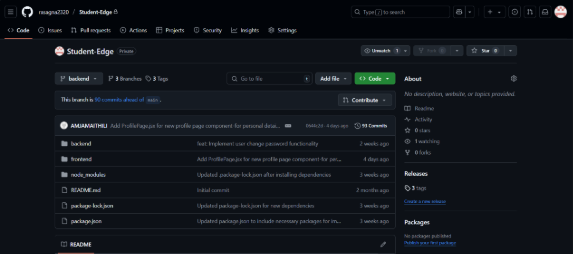

**Fig:6.27**: *GitHub Repository*

As shown Fig 6.27, this is the GitHub Repository of StudentEdge, it has backend and frontend folders

**7. CONCLUSION AND FUTURE SCOPE**

The Student Profile Management System represents a significant step toward streamlining the process of connecting students with potential employers. By offering a centralized platform for students to manage their profiles, showcase skills, and access relevant opportunities, the system addresses a critical need in the academic and professional landscape. Students can create detailed profiles including personal background, current status, and links to platforms like LinkedIn, GitHub, and coding profiles—presenting a holistic view of their qualifications.

The system empowers the Career Development Cell (CDC) to efficiently search for and shortlist students based on multiple criteria, including keywords and job descriptions, ensuring a more targeted and effective placement process. Features such as profile management, skills and certification tracking, project showcasing, resume generation, and AI-assisted search give both students and CDCs a strategic advantage. With React, Node.js/Express, and MongoDB ensuring responsiveness and scalability, and DeepSeek AI handling intelligent resume creation, the system is both modern and powerful.

**7.1: Unique Selling Proposition (USP) of Student Edge**

Student Edge stands out as a comprehensive, AI-powered platform tailored specifically for student career development, addressing critical gaps in traditional university Training & Placement (T&P) portals and generic job platforms like Naukri and LinkedIn. Unlike conventional T&P systems that rely on basic data entry and manual shortlisting, Student Edge leverages advanced AI tools, such as the Deepseek API, to enable intelligent keyword extraction, profile matching, and automated resume generation. This ensures a dynamic, student-centric approach that simplifies profile management and enhances employability by allowing students to create detailed profiles with academic metrics (e.g., CGPA, branch) and co-curricular achievements, which are often overlooked by industry-focused job portals. The platform’s AI-driven resume parsing engine transforms uploaded resumes into structured profile fields, streamlining the process of presenting professional qualifications and reducing manual effort for students.

For Career Development Cells (CDCs), Student Edge offers a powerful, intuitive solution to overcome the limitations of generic filtering tools in existing systems. By integrating a search intelligence module and similarity matching algorithms, the platform enables CDCs to perform advanced, document-based searches and calculate precise match percentages between student profiles and job requirements. This addresses the absence of intelligent search and automated matchmaking in traditional platforms, allowing placement officers to efficiently shortlist candidates based on specific criteria like skills, academic performance, and extracurricular involvement. Developed with a modern MERN stack and supported by Agile methodologies, Student Edge ensures scalability and adaptability, making it a future-ready tool that bridges the gap between students and employment opportunities while empowering academic institutions with data-driven recruitment capabilities.

In conclusion, the Student Profile Management System offers a robust solution for improving campus recruitment. It enhances student visibility, supports CDC operations, and creates a more efficient, AI-powered recruitment workflow that benefits all stakeholders.

These are a few future enhancements and directions we are planning to pursue, and we believe that these changes will significantly improve the Student Profile Management System over time. The following potential areas could be explored: 

**7.2 Enhanced Student Profiles**

We plan to expand student profiles to include fields like hobbies, volunteer work, and personal interests for a more holistic view. Multimedia additions, such as video introductions and portfolio showcases, will help students express themselves beyond academics.

**7.3 Resume Enhancement**

To simplify the job application process, we can offer a variety of built-in resume templates. Students can select designs tailored to specific roles, aided by GenAI for customization. Features like uploading personal templates and managing multiple resume versions are also planned.

**7.4 Profile Completion Tracking**

A visual progress tracker (e.g., completion circle) will guide students in completing their profiles. Gentle reminders and improvement tips will ensure students present their most complete and impressive profiles.

**7.5 Deployment and Real-World Use**

We aim to deploy the system in real-world environments, focusing on scalability, security, and maintenance. Collaboration with Career Development Cells will ensure smooth integration, user training, and continuous system optimization.

**8.KEY TAKEAWAYS**

Working on this project made me realize how much thought and work goes into building real-world applications and it’s not just about writing code, but solving actual problems for users. 

**8.1 TECHSTACK** 

When I started the project, I wasn’t fully confident with the **tech stack**; we used React, Node.js, Express, and MongoDB. In the beginning, setting up routes, managing state in React, and connecting the frontend to the backend felt a bit overwhelming. But as I worked I got better at organizing components, writing cleaner API calls, and handling data properly. On the backend, I learned how to build REST APIs, connect to MongoDB, and manage data flow smoothly. Styling with plain CSS also improved over time.Overall, this project helped me turn my basic knowledge into actual working skills by applying everything in a real-world scenario.

**8.2 DIGITAL PUMPKIN**

The **Digital Pumpkin problem-solving framework** helped us break down our idea into a clear problem, solution, and execution plan. It provided a structured approach that made the development journey smoother and more goal-oriented. All the question and answers have played an important role on how to implement the features and question myself about the feature in depth.

**8.3 PROMPT ENGINEERING**

At the start, I didn’t really know how to give proper prompts to AI tools,I would just type random questions and hope for good results. But as I used models like ChatGPT, Deepseek etc ,more often, I slowly figured out how to structure my prompts better. I learned that being clear, giving context, and breaking things down step by step gave more accurate responses. That’s when I understood the importance of **prompt engineering** and how the way you ask directly affects the output. Over time, I stopped relying on trial and error and started thinking from the AI’s point of view, which really improved the results, especially while building features or writing code.

**8.4 GENAI FEATURES**

The most exciting part for me was working on **AI-based features**. Integrating skill extraction, resume-based profile creation, and match percentage calculations pushed me into unfamiliar territory. I learned how to use prompt engineering effectively to get the right outputs from tools like Deepseek after exploring other relevant AI’s and other AI APIs. It was challenging at first, but once I got the hang of it, I realized how powerful these tools can be when used thoughtfully.

**8.5 SALESFORCE CERTIFICATIONS**

We also completed **Salesforce certifications**(as shown in fig 8.1) alongside the project. The associate level gave me a basic understanding of AI in Salesforce, while the specialist one helped me go deeper into model building and tools like Einstein Prediction Builder. Though this wasn’t directly used in our project, it gave me a better understanding of real-world AI use cases.

     ****

***Fig 8.5:*** Salesforce AI Associate and Agentforce Specialist certificates 

**8.6 GITHUB TIMELINES**

Maintained timely commits as shown in Fig 8.4 on github to track consistent progress and development phases. Gained hands-on experience resolving merge conflicts and managing collaborative workflows.

***Fig 8.6:*** Github timeline and recent github commits of our project

**8.7 LINKEDIN POSTS**

Shared my learning journey on **LinkedIn**(Fig 8.3), highlighting growth in practical skills and project experience. Emphasized how this opportunity strengthened my ability to apply technical concepts in real-world scenarios.

             

***Fig 8.7:***Posts shared on my Linkedin account ,sharing about the project to my Connections

` `**8.8 HONEWELL PRESENTSTION**

One of the highlights of this project was presenting my **Generative AI** concept to recruiters from **Honeywell** during a special session. I explained how I used Deepseek LLM to extract skills from resumes, generate profiles, and calculate match percentages based on job requirements.I focused on how the idea could actually help automate and simplify the student placement process. Sharing my thought process, the problem we were solving, and how AI was being used practically made me more confident about both my technical skills and how to communicate them clearly to industry professionals as in Fig 8.2

***Fig 8.8*:** GenAI Demonstration at Honeywell Presentation

**8.9 MY CONTRIBUTIONS AND LEARNINGS**

I contributed to the **Frontend** by focusing on clean, responsive interface design using CSS. I spent significant time refining layout details like spacing, margins, and paddings to enhance visual polish. This experience strengthened my patience and attention to detail in UI development.\
It also helped me understand how small design choices can greatly impact user experience.

\
On the **AI** side of the project, I worked on integrating resume generation and keyword extraction using prompt-engineered inputs. I explored and tested multiple AI tools, finalizing Deepseek for its reliable results. These features improved the accuracy and automation of student profile creation and matching.

\
The **CDC Dashboard** was a turning point in how I approached the platform. Instead of just thinking like a student, I had to design features from the perspective of someone managing hundreds of profiles; building filters for CGPA, section, branch, and keywords showed me how important structured data and role-specific interfaces are in building powerful tools.

\
Working with **Git** was another area where I struggled initially. Merge conflicts, broken commits, and sync issues were frustrating. But over time, I got the hang of using branches properly, pushing and pulling changes with confidence, and even resolving conflicts without panicking. It made me appreciate how important version control is in any project.

\
The project pushed me beyond just writing code it challenged how I think about usability, collaboration, and real-world impact.

` `**BIBLIOGRAPHY**

MongoDB Inc. (2023). *MongoDB Documentation*. Retrieved from <https://www.mongodb.com/docs>

Express.js Foundation. (2023). *Express: Web Framework for Node.js*. Retrieved from <https://expressjs.com/>

React. (2023). *React – A JavaScript Library for Building User Interfaces*. Retrieved from <https://reactjs.org/>

Node.js Foundation. (2023). *Node.js Documentation*. Retrieved from <https://nodejs.org/en/docs>

Auth0 by Okta. (2023). *JWT Introduction and Use Cases*. Retrieved from <https://jwt.io/introduction>

bcrypt. (2023). *Password Hashing Function*. Retrieved from <https://www.npmjs.com/package/bcrypt>

Google Cloud AI. (2024). *Gemini API: Multimodal AI Services*. Retrieved from <https://cloud.google.com/vertex-ai/docs/generative-ai>

Pandas Development Team. (2023). *Pandas: Python Data Analysis Library*. Retrieved from <https://pandas.pydata.org/>

OpenAI. (2024). *AI-Powered Resume Analysis using GPT*. Retrieved from <https://platform.openai.com/docs>

World Wide Web Consortium (W3C). (2023). *HTML and CSS Standards*. Retrieved from <https://www.w3.org/>

2

